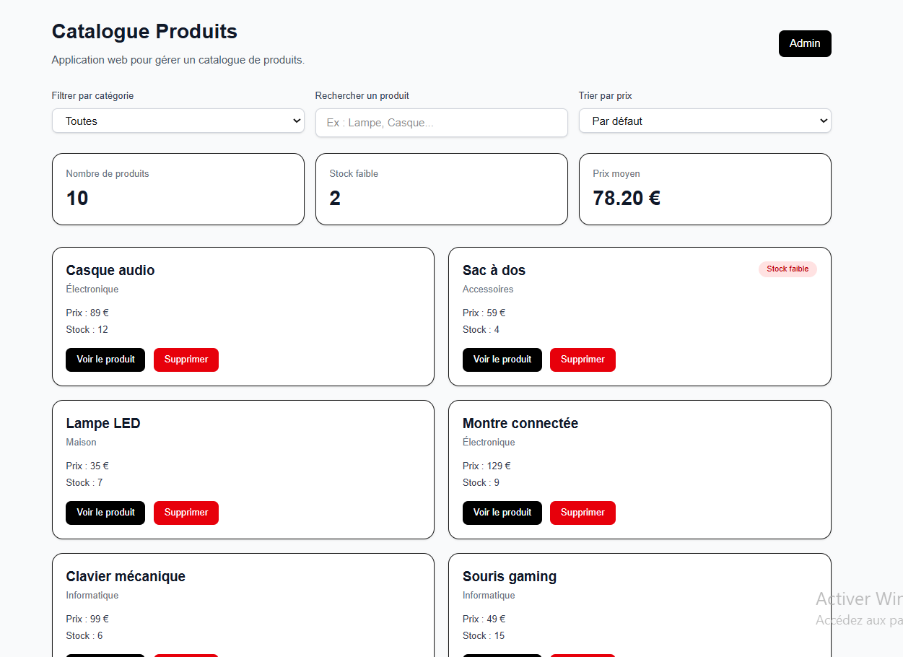
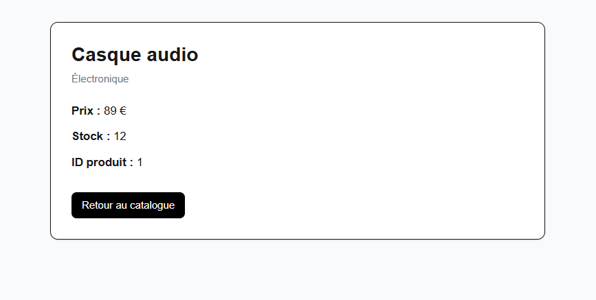
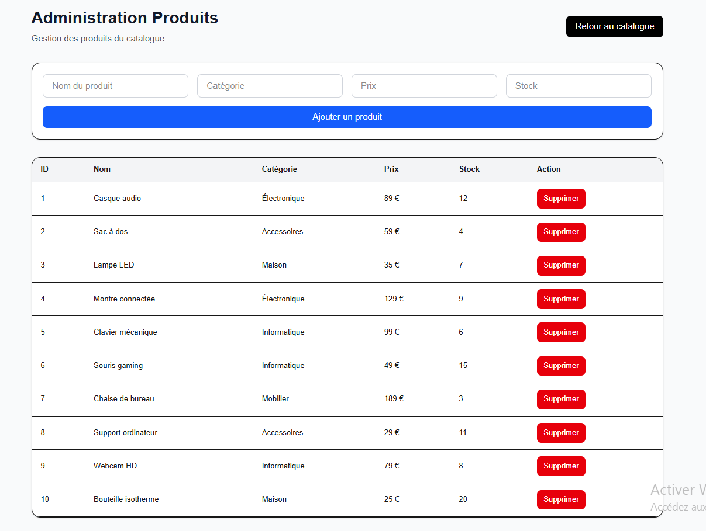

# 🛍️ Catalogue Produits – Application Full Stack

Application web full-stack permettant de gérer un catalogue de produits avec une interface publique et une interface d'administration.

Ce projet démontre la création d'une application complète avec :

- une interface utilisateur moderne
- une API REST
- une base de données SQL
- une interface d'administration
- un CRUD complet

---

# 📸 Aperçu de l'application

## Catalogue des produits



---

## Page détail produit



---

## Interface administration



---

# 🚀 Fonctionnalités

### Catalogue

- affichage de la liste des produits
- filtre par catégorie
- recherche de produits
- tri par prix
- indicateur de stock faible

### Dashboard

- nombre total de produits
- produits avec stock faible
- prix moyen

### Page produit

- page dynamique
- affichage des détails d'un produit

### Interface Admin

- ajout de produit
- suppression de produit
- visualisation du stock

### API REST

Endpoints :
GET /api/products
→ récupérer la liste des produits

POST /api/products
→ ajouter un nouveau produit

DELETE /api/products/[id]
→ supprimer un produit

# 🧠 Technologies utilisées

## Frontend

- Next.js
- React
- TypeScript
- Tailwind CSS

## Backend

- API Routes Next.js

## Base de données

- Prisma ORM
- SQLite

---

# 🗂️ Architecture du projet

catalogue-app
├── app
│   ├── api
│   │   └── products
│   │       ├── route.ts
│   │       └── [id]
│   │           └── route.ts
│   │
│   ├── admin
│   │   └── page.tsx
│   │
│   ├── product
│   │   └── [id]
│   │       └── page.tsx
│   │
│   ├── layout.tsx
│   ├── page.tsx
│   └── products.ts
│
├── lib
│   └── prisma.ts
│
├── prisma
│   ├── schema.prisma
│   ├── seed.ts
│   └── migrations
│
├── public
│   └── images
│       ├── admin.png
│       ├── catalogue.png
│       └── product.png
│
├── .env
├── package.json
└── README.md

# ⚙️ Installation

Cloner le projet :

```bash
git clone https://github.com/ton-utilisateur/catalogue-app.git

cd catalogue-app
npm install
```

Créer la base de données :

```bash
npx prisma migrate dev
```

Remplir la base avec des produits :

```bash
npx tsx prisma/seed.ts
```

Lancer le serveur :

```bash
npm run dev
```

Ouvrir l'application :

```
http://localhost:3000
```

Interface administration :

```
http://localhost:3000/admin
```

---

# Objectif du projet

Ce projet a été réalisé pour pratiquer le développement full-stack moderne avec :

- React
- Next.js
- Prisma
- SQL

Il démontre la création d'une application complète comprenant :

- un frontend moderne
- une API backend
- une base de données
- une interface d'administration
- un système CRUD complet.

---

# Auteur

Projet réalisé dans le cadre de l’apprentissage du développement web full-stack.